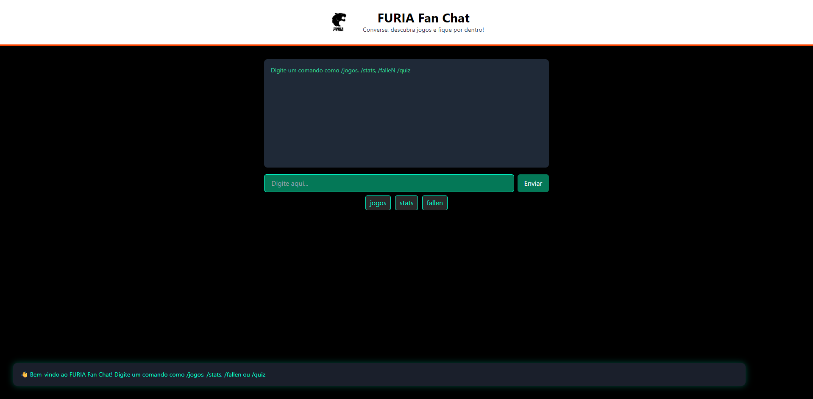

# 🐱 ChatBot FURIA

Este é o **ChatBot da FURIA**, uma aplicação web interativa feita para fãs do time de CS da FURIA Esports. Com comandos simples, os usuários podem acessar informações sobre o time, estatísticas, o jogador FalleN e até testar seus conhecimentos com um quiz.

## 🚀 Funcionalidades

O bot responde aos seguintes comandos digitados pelo usuário:

- `/jogos`: mostra os próximos jogos da FURIA;
- `/stats`: exibe estatísticas gerais do time;
- `/falleN`: apresenta informações sobre o jogador FalleN;
- `/quiz`: inicia um quiz sobre a FURIA Esports.

## 🖥️ Tecnologias Utilizadas

- HTML5
- CSS3
- JavaScript (sem frameworks)
- Nenhum backend ou API externa

## 🖥️ Tela Principal


1. Clone o repositório:

```bash
git clone https://github.com/seu-usuario/chatbot-furia.git
cd chatbot-furia
```
Desenvolvido por: Caio Cesar Miranda de Oliveira - UFRN/EAJ
